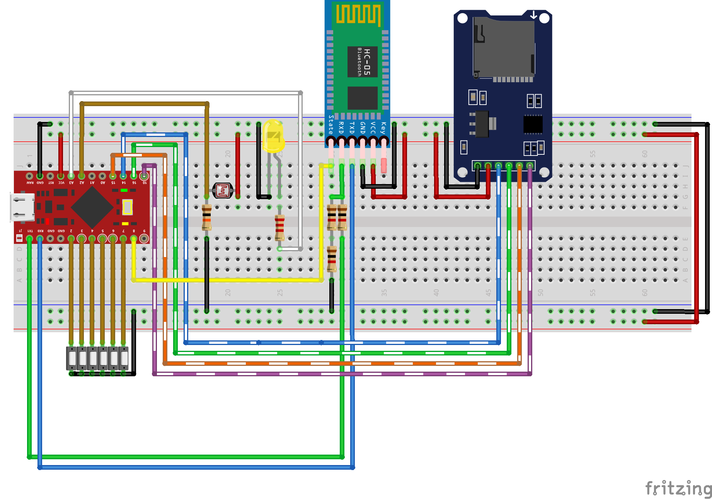

# USB Keystroke Injector
An Arduino-based keyboard emulator which injects (i.e. types) a sequence of letters received via Bluetooth protocol or read from predefined SD card payloads.
<p align="center">

</p>

## SD card mode
When it's on SD-card mode, it reads content of a payload (which is selectable using three switches; means 8 possible payloads) from inserted SD card and starts typing them as soon as being recognized as a keyboard to the host.
Payloads must be written in a simple syntax explained below.

When the payload injection is done, it automatically switches to Bluetooth mode to give more control to the operator.

Here is how it looks like (GIF size: 11 MB):  


## Bluetooth mode
When it's explicitly set to Bluetooth mode, it has nothing to do with the SD card. As soon as it gets plugged into the host, it'll wait for the operator to connect via Bluetooth protocol.  
[Bluetooth Terminal HC-05](https://play.google.com/store/apps/details?id=project.bluetoothterminal) can be used as a simple (yet powerful) client for Android based devices. Install it, connect to the device and let it recognize itself as a keyboard to the host. When it's ready, type whatever you need using the a simple syntax explained below.

Here is how it looks like (GIF size: 5 MB):  


## ... and a bonus!
A photoresistor is implemented in the circuit which can be used as an activator. It can be used by `{LDR}` action (see Payload Syntax section).
Basically, it'll keep the initial brightness and will wait for the room to become darker (like when lights go off). Then, it'll continue its operation.


# Requirements and Installation

## Required components
* Arduino Pro Micro or other compatible arduinos which must have:
  * A built-in USB transceiver (like ATmega3U4; note the letter **U** in the model)
  * An extra hardware serial port

 > If you're not using Arduino Pro Micro, you must follow your device pinout instead of the following schematic.

* HC-05 Bluetooth module
* MicroSD Card Adapter
* A 6-position DIP switch
* (Optionally) a photoresistor
* (Optionally) an LED 
* Several resistors

## Assemble the circuit
First, you need to assemble the following circuit (the schematic is also available as a fritzing project in `schematic` directory):  


## Program the software
Codes are available in `sources` directory as an [Arduino IDE](https://www.arduino.cc/en/Main/Software) project. Connect your device and simply program it.

# Configuration
Main functionality can be configured with the switches (so you don't need to re-program again and again for simple changes).  
State of switches are explained below:  

| Switch #   	| Name                	| On                                                                 	| Off                                                             	|
|------------	|---------------------	|--------------------------------------------------------------------	|-----------------------------------------------------------------	|
| #0 (Left)  	| Keyboard Emulation  	| Device will operate its normal operation                          	| Device won't act as a keyboard<br>**Required when re-programming** 	|
| #1         	| Debug               	| It'll wait for Bluetooth connection and will report more verbosely 	| It'll act normally                                              	|
| #2         	| Mode                	| The operation will be on SD card mode                              	| The operation will be on Bluetooth mode                         	|
| #3         	| Payload selector #0 	| Payload number +4 (priority)                                       	| Keeps the payload number as is                                  	|
| #4         	| Payload selector #1 	| Payload number +2 (priority)                                       	| Keeps the payload number as is                                  	|
| #5 (Right) 	| Payload selector #2 	| Payload number +1 (priority)                                       	| Keeps the payload number as is                                  	|

For example, if you want to operate on SD card with payload on index 3 (`PAYLOAD3.txt` in the SD card), you'll need to configurate switches like this:
```
Pin:              #0                  #1                  #2                     #3         #4          #5
State:            1                   0                   1                      0          1           1
Means:      Emulation ON          Debug OFF          SD card mode     Payload#: (+0         +2          +1)
```


# Payload Syntax
Payloads in either SD card files or Bluetooth communication data should follow these rules:
* Lines must be terminated with `\n` instead of `\r\n` or `\r`;
* Lines can be either a single predefined action (see below) or a sequence of characters.

That was all! cool, isn't it?  
There are few predefined actions which can make your script lighter and easier to read. Each of them must be typed in a separate line. They are:

| Line                             	| Functionality                                                                                                           	|
|----------------------------------	|-------------------------------------------------------------------------------------------------------------------------	|
| {ENTER}                          	| Presses Enter/Return key (you'll need it a lot)                                                                                    	|
| {POWERSHELL}                     	| Opens Windows PowerShell in administrator mode and bypasses UAC                                                                                               	|
| {RUN}                            	| Opens Windows Run                                                                                                       	|
| {D100} {D500} {D1K} {D5K} {D10K} 	| Delays in miliseconds                                                                                                   	|
| {HIDE}                           	| Hides current window by dragging it to bottom of screen (useful for long processing tasks)                                                                 	|
| {LDR}                            	| Stops the execution and waits for the photoresistor to reach a tolerate defined in `a_globals.h` for a reasonable period of time	|
| Anything else                    	| Will be typed directly, letter by letter                                                                                	|

You can see example payloads in `payload-examples` directory.
Feel free to extend your predefined actions in `m_keyboardAndMouse.ino` file.


**Note**: Due to limited memory size of Arduino and one-time SD card initialization, you need to keep the overall payload size below `MAX_SDCARD_LEN` (default: 1400 bytes) and each line below `MAX_PAYLOAD_LEN` (default: 300 bytes) or else, you may face some weird functionalities!

These constraints can be changed in `a_globals.h` file or you can write your own method to read payloads line by line from the SD card itself, instead of loading them into the memory on initialization.

# Contribution
Feel free to extend the functionality of the device and submit some Pull Requests. They'll be reviewed and merged as soon as possible. Just please consider limitations of Arduino especially its memory size.

# Disclaimer
Neither the author nor any contributers of this projects are responsible for any kind of misuses that can be happen using this project. This is an educational project and is not developed to be a stable, operation-ready device.

There are pretty good uses for this project including:
* Using Bluetooth mode to controle your computer remotely;
* Extending the security of the device and using it as a simple security key;
* Using photoresistor to put the computer in sleep mode whenever the lights are turned off;
* Using it for penetration testing;
* And plenty of other uses ...

# License
This project is licensed under [Apache License 2.0](LICENSE).

# See Also
* [ByteGate](https://bytegate.ir/) (our blog)
* [تبدیل PDF به ورد](http://delix.ir/) (our sponsored service)
