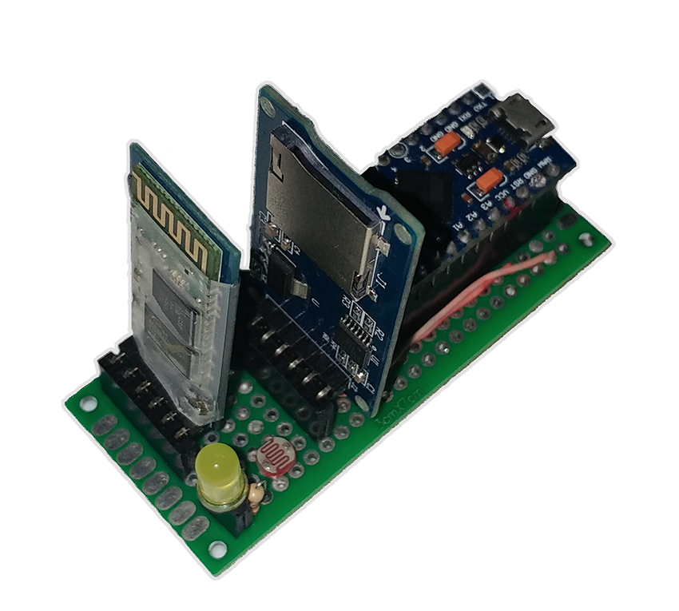

# USB Keystroke Injector
An Arduino-based keyboard emulator which injects (types) a sequence of letters sent via Bluetooth protocol or from predefined SD card payloads.

## SD card mode
When it's on SD-card mode, it reads content of the a payload (which is selectable using three switches; means 8 possible payloads) and starts typing them as soon as being recognized as a keyboard to the host.
Payloads must be written in the software's simple syntax explained below.

When the payload injection is done, it automatically switches to Bluetooth mode to give more control to the operator.

Here is how it looks like (GIF size: 11 MB):  

## Bluetooth mode
When it's explicitly set to Bluetooth mode, it has nothing to do with the SD card. As soon as it gets plugged into the host, it'll wait for operation to connect via Bluetooth protocol.  
[Bluetooth Terminal HC-05](https://play.google.com/store/apps/details?id=project.bluetoothterminal) can be used as a simple (yet powerful) client for Android based devices. Install it, connect to the device and let it recognize itself as a keyboard. When it's ready, type whatever you need using the software's simple syntax explained below.

Here is how it looks like (GIF size: 5 MB):  

## A Bonus!
A photoresistor is implemented in the circuit which can be used a an activator. It can be used by `{LDR}` action (see Payload Syntax section).
Basically, it'll keep the initial brightness and will wait for the room to become darker (like when lights go off). Then, it'll continue it's operation.

# Requirement and Installation

## Components
* An Arduino with built-in USB transceiver and an extra Serial port 

This project is based-on **Arduino Pro Micro** however, it should be compaitible with any other Arduino based-on microprocessors with built-in USB transceiver (like ATmega3U4. Note the letter **U** in the model).  
Software Serial emulator can be used but believe me, that can become a mess if you're not familiar with them. Extra hardware Serials are pretty easy to be used.  
If you're not using Arduino Pro Micro, you must follow your device pinout instead of the following schema.

* HC-05 Bluetooth module
* MicroSD Card Adapter
* A 6-position DIP switch
* (Optionally) a photoresistor
* (Optionally) an LED 
* Several resistors

## Assemble circuit
First, you need to assemble the following circuit (the schematic is also available as a fritzing project):  

This how it will look like at the end:

## Program the software
Open source codes available in `sources` directory as an [Arduino IDE](https://www.arduino.cc/en/Main/Software) project. Connect your device and simply program it.

# Configuration
Main functionality can be configured with the switches (so you don't need to program again and again for simple changes).  
States of switches are explained below:
| Switch #   	| Name                	| On                                                                 	| Off                                                             	|
|------------	|---------------------	|--------------------------------------------------------------------	|-----------------------------------------------------------------	|
| #0 (Left)  	| Keyboard Emulation  	| Device will operate it's normal operation                          	| Device won't act as a keyboard **Required when re-programming** 	|
| #1         	| Debug               	| It'll wait for Bluetooth connection and will report more verbosely 	| It'll act normally                                              	|
| #2         	| Mode                	| The operation will be on SD card mode                              	| The operation will be on Bluetooth mode                         	|
| #3         	| Payload selector #0 	| Payload number +4 (priority)                                       	| Keeps the payload number as is                                  	|
| #4         	| Payload selector #1 	| Payload number +2 (priority)                                       	| Keeps the payload number as is                                  	|
| #5 (Right) 	| Payload selector #2 	| Payload number +1 (priority)                                       	| Keeps the payload number as is                                  	|

# Payload Syntax

Payloads in either SD card or Bluetooth communication should follow these rules:
* Lines must be terminated with `\n` instead of `\r\n` or `\r`;
* Lines can be either a single predefined action (see below) or a sequence of characters.

That was all! cool, isn't it?  
There are few predefined actions which can make your script lighter and more easy-to-read. Each of them must be typed in a separate line. They are:

| Line                             	| Functionality                                                                                                           	|
|----------------------------------	|-------------------------------------------------------------------------------------------------------------------------	|
| {ENTER}                          	| Presses Enter (you'll need it a lot)                                                                                    	|
| {POWERSHELL}                     	| Opens Windows PowerShell                                                                                                	|
| {RUN}                            	| Opens Windows Run                                                                                                       	|
| {D100} {D500} {D1K} {D5K} {D10K} 	| Delays in miliseconds                                                                                                   	|
| {HIDE}                           	| Hides current window (useful for long processing tasks)                                                                 	|
| {LDR}                            	| Stops execution and waits for photoresistor to reach the tolerate defined in `a_globals.h` for a reasonable time period 	|
| Anything else                    	| Will be typed directly, letter by letter                                                                                	|

You can see sample payloads in `payload-examples` directory.
Feel free to extend your predefined actions in `m_keyboardAndMouse.ino` file.

**Note**: Please note that due to Arduiono's limited memory size and one-time SD card initialization, you need to keep the overall payload size below `MAX_SDCARD_LEN` (default: 1400 bytes) and each line below `MAX_PAYLOAD_LEN` (default: 300 bytes) or else, you may face some weird functionalities!

These constraints can be changed in `a_globals.h` file or you can write your own method to read payloads line by line from the SD card itself, instead of loading them into the memory on initialization.

# Contribution
Feel free to extend the functionality of the device and submit some Pull Requests. It'll be reviewed and merged as soon as possible. Just please consider Arduino's limitation especially it's memory size.

# Useful Links
* [Telegram Bot API](https://core.telegram.org/bots/api)
* [ByteGate](https://bytegate.ir/) (our blog)
* [Persian PDF to Word Converter] (http://delix.ir/) (our sponsored service)

# Disclaimer
Neither the author nor any contributers of this projects are responsible for any kind of misuses that can be happen using this project. This is an educational project and is not developed to be a stable, operation-ready device.

There are pretty good uses for this project including:
* Use Bluetooth mode to controle your computer remotely;
* Extend the security of the device and use it as a security key;
* Use photoresistor to put the computer in sleep mode whenever the lights are turned off;
* Use it for pentest purpose;
* And plenty of other uses ...
